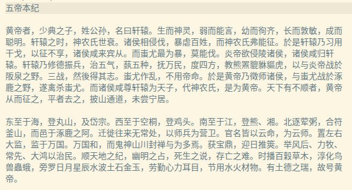
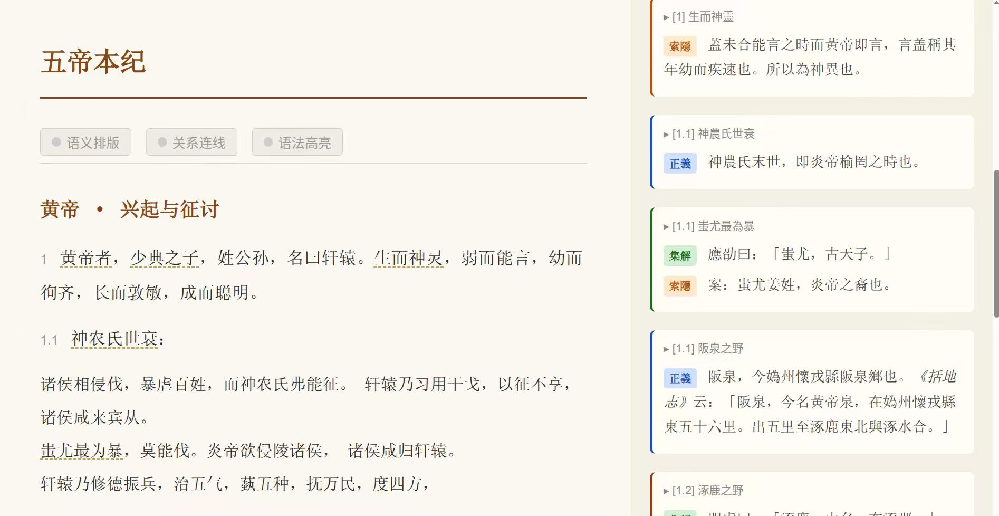
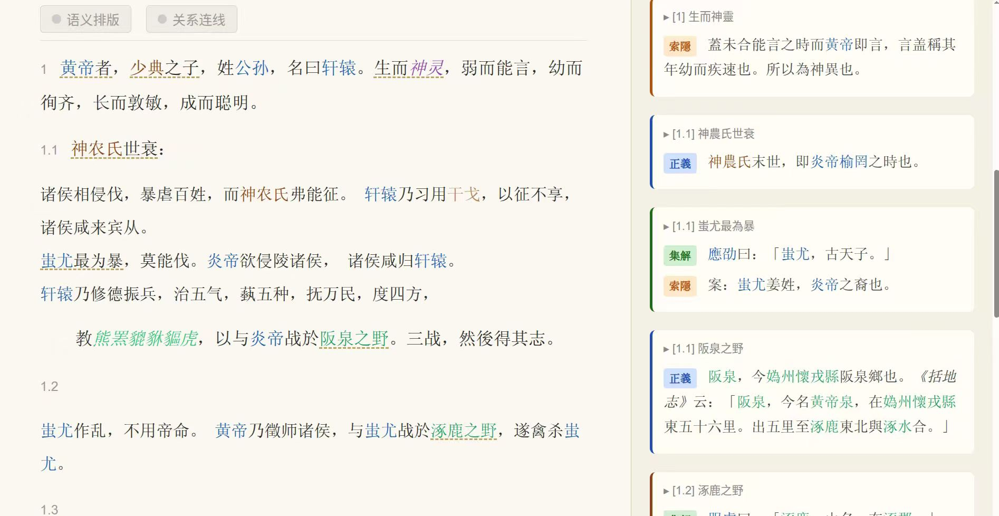
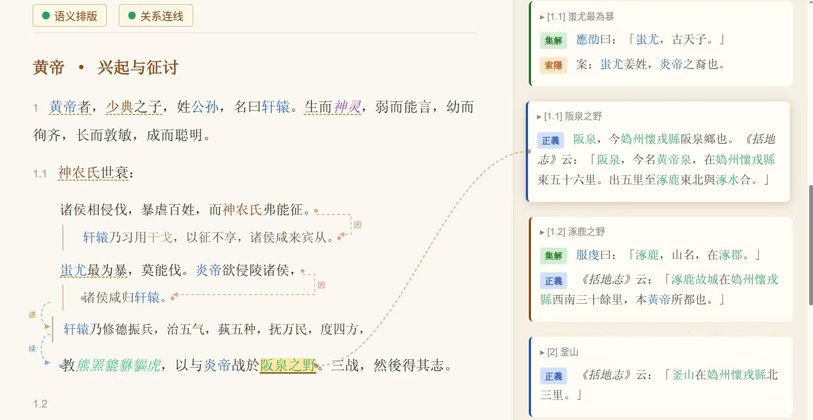
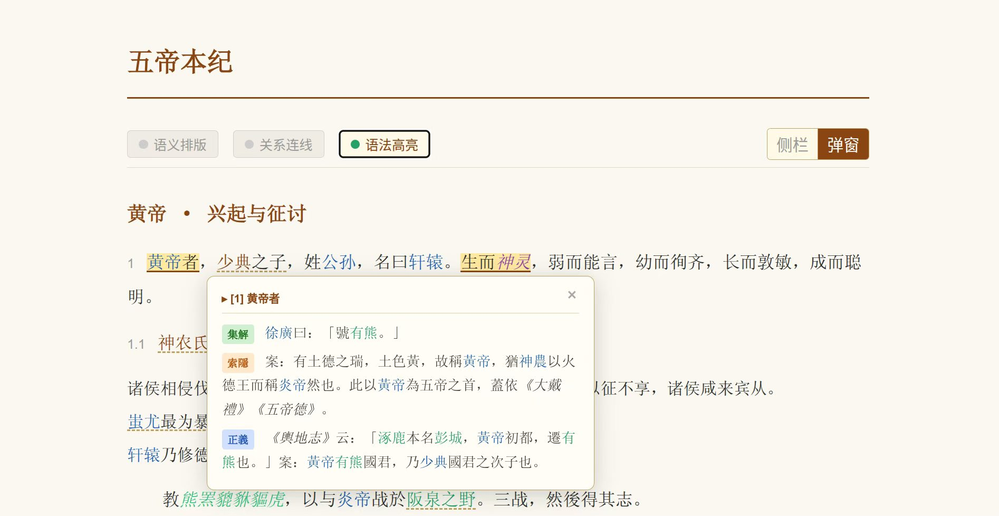

# 从阅读到应用：当《史记》变成知识库

创造者：西瓜 以下为第一人称撰写

---

想象这样一个场景。

你在读《史记·项羽本纪》，读到鸿门宴。"沛公军霸上，未得与项羽相见。"你想知道：霸上在哪里？项羽和刘邦当时各有多少兵力？范增是谁，他和项羽的关系是什么？此前发生了什么，才让两个人在这一刻剑拔弩张？

如果你是普通读者，你会打开百度，跳出几个互相矛盾的词条，读了半天还是没搞清楚。如果你是研究者，你会翻出注释本，找裴骃的《集解》，找司马贞的《索隐》，在几本书之间来回翻查。

文字在那里。知识也在那里。但它们是分散的、静止的、不可查询的。

这就是我一直想解决的问题。

---

## 阅读器的五个层次

上一篇文章讲了语法高亮——给古文里的人名、地名、官职涂上颜色，让信息结构一眼可见。（[传送门：给《史记》加上语法高亮](公众号文章/2026-03-08_给史记装上语法高亮.md)）

这个周末，阅读器又往前走了几步。用五张截图来说明。

图一是原始文本。黑字白底，司马迁两千年前写下它时的样子。



图二加上了专名标注和三家注侧栏。人名、地名被识别并加上下划线，右侧同步显示古代注家的注释。颜色还没有，但结构已经开始浮现。



图三加上了语法高亮——这是上一篇文章的主题，这里不再展开。



图四是这个周末新做的：语义排版加上关系连线。句子和句子之间，用虚线箭头标出逻辑关系——因、所以、进而。论述的骨架第一次在视觉上可追踪。



图五是三家注弹窗。鼠标悬停在任何一个词上，裴骃、司马贞、张守节一千多年前写下的注释自动浮现。不用离开页面，不用翻书。



五张图，同一段文字，五种状态。每一步都不改变一个字，只是让已有的信息结构变得可见。

---

## 技术方法论：从原始文本到知识库的九步管线

语法高亮解决了"看"的问题。知识库解决的是"用"的问题。两者之间，是一套完整的工程管线。

### 九步管线

从一段原始古文，到可查询的结构化知识，整个过程分九个阶段，每个阶段有明确的输入、输出和验证工具：

```
原始文本
  │
  ▼ 01 校勘 ── 自动比对多个版本，定位异文，生成定本
  │
  ▼ 02 结构分析 ── 切分章节/段落/句子，分配层级编号，
  │              标注句间语义关系（因果/递进/转折），
  │              对齐三家注释层
  │
  ▼ 03 实体构建 ── AI批量NER标注（18类，~9.8万次），
  │              多轮反思审查迭代修正，别名消歧
  │
  ├─▼ 04 事件构建 ── 提取结构化事件（3,185个），
  │               推断公元纪年，十轮反思校正
  │
  ├─▼ 05 关系构建 ── 9种关系类型（4种自动计算+5种LLM推断），
  │               7,637条事件关系，人物关系SPO三元组
  │
  ├─▼ 06 本体构建 ── 实体词表→分类树→OWL/RDF，
  │               支持SPARQL查询
  │
  ▼ 07 逻辑推理 ── 矛盾检测，洞见挖掘，
  │              生卒年区间推断，时序推理
  │
  ▼ 08 SKU构造 ── 知识单元化：Factual（事实包）/
  │              Procedural（技能单元）/Relational（关系图）
  │
  ▼ 09 应用构造 ── 阅读器渲染，时间线，问答，游戏化
```

这九步不是线性的——03到06可以并行，每步都有对应的自动验证工具（lint、validate、cross-check），形成闭环。

### 驱动管线的不是代码，是SKILL

这套管线的执行，没有人从头写过一行传统程序。每一步对应一份SKILL文档——用结构化的自然语言写清楚：输入是什么，处理逻辑是什么，输出是什么，怎么验证。AI读SKILL，执行SKILL，产出结果。

SKILL不是提示词。提示词是即兴的、一次性的；SKILL是可复用的方法论单元，像函数一样可以被调用、被组合、被继承。管线里的每一步都有对应的SKILL，从实体标注到事件提取，从反思审查到纪年推断。

然后是这件事最有意思的地方：**提炼SKILL本身也是一个SKILL**。

读一本书，把它的研究逻辑抽象出来——基于什么输入，收集什么数据，推理过程是什么，输出是什么——这个过程可以被形式化，然后写成一份SKILL，让AI来执行。李开元的历史探案逻辑可以变成SKILL，马伯庸的素材整理逻辑可以变成SKILL，甲骨文单字研究的方法论可以变成SKILL。

这意味着整套知识增殖的过程可以**自举**：系统可以从任何一本书里学会新的研究方法，把这个方法编码成SKILL，然后用这个SKILL处理下一批材料——不需要程序员介入，不需要重新训练模型，只需要会读书。

### 四层语义：理解为什么要这么分

九步管线背后，是一个四层的语义模型。每一层回答不同的问题，用一个例子来说：

**第一层：结构语义** — 文本怎么组织的？句子间什么关系？

原始古文没有段落编号，没有句间逻辑标注。这一层给每个句子分配坐标（如 `1.2.3`），标注"因为……所以……"的逻辑链条。图四里那些虚线箭头，就是结构语义的直接视觉输出。三家注也在这一层被对齐到正文的具体句子上——裴骃注的是哪句话，司马贞注的是哪个词，不再是飘在空中的文字。

**第二层：图谱语义** — 谁做了什么？在哪里？什么时候？

"项羽"在《史记》里出现了几百次，分散在130篇里。这一层把这些碎片聚合起来——他是人名（不是地名也不是官职），他有多个称呼（项籍、项王、西楚霸王），他参与过哪些事件，那些事件发生在哪一年的哪个地点。9.8万次标注，18类实体，把整部史书里所有"谁、在哪里、什么时候、做了什么"的信息结构化出来。

**第三层：知识语义** — 这些实体怎么分类？遵循什么规律？

这里发生了一件有意思的事。一开始只设计了11类实体。但AI标注之后，发现"朝代"这个类出了问题：秦作为朝代（秦朝）、秦作为诸侯国（秦国）、刘氏作为血缘集团——被混标在一起了。类是设计出来的，但边界是从错误里发现的。最终拆分成了18类——类的演化不是设计，是从数据里归纳出来的。

这一层还做本体推理：父子关系可以传递（父→子→孙），时序关系可以推断（A在B之前 + B在C之前 → A在C之前）。这些看起来简单，但对于跨130篇的3,185个事件，机器推理能覆盖人工难以系统做到的范围。

**第四层：应用语义** — 历史真相是什么？有哪些矛盾？能发现什么规律？

这一层的产出不是数据，是洞见。下面单独讲。

这四层严格递进：没有结构编号，无法定位实体语境；没有实体识别，无法提取事件；没有图谱，本体没有原料；没有知识语义，应用层无从查询。

### 系统发现了什么

管线跑完之后，开始出现让人惊讶的东西。

**矛盾**。《史记》第007篇《项羽本纪》记载，项羽在东城之战以28骑冲击数千汉军，斩杀"数十百人"。第008篇《高祖本纪》记载，灌婴追杀项羽于东城，斩首"八万"。

同一场战役，两种记载，数字相差超过100倍。

这个矛盾不是新发现——研究者早就知道《史记》自相矛盾。但以前，这类矛盾需要学者逐篇精读才能发现。现在，当所有事件都被标注了时间、地点、参与者，一次一致性检验就能跑出全书的矛盾清单。项羽之死、太子丹之死（两篇差了4年，归因还不同）、下宫之难（两篇差了14年）……这些矛盾现在都在同一张表格里，可以分级、可以分析、可以系统性地提出解释。

还有一类更有意思的矛盾——**沉默证据**。

秦始皇在位37年，《史记》完全没有记载他的皇后是谁。他的儿子扶苏、胡亥的母亲，也完全没有记载。《外戚世家》专门记载皇后事迹，但秦代部分是空白。

这不是遗漏，这是一个谜。当知识库建立了"君主→应有→皇后"的本体规则，把所有帝王过一遍：黄帝有嫘祖，禹有涂山氏，刘邦有吕后……秦始皇那一格是空的。异常自动浮现。

**从数据里长出来的洞见**。Eureka文档里记录了管线运行中发现的一类规律——"推恩令模式"：强制让诸侯把土地分给所有儿子，而不是长子独继，表面上是皇帝的慷慨，实质上是让诸侯国一代一代自动碎裂。没有直接冲突，没有明显强制，几代之后诸侯自然消亡。这类治国逻辑，在《史记》里出现了不止一次，以不同的形式。当所有相关事件被标注和关联，这类跨章节的模式才第一次变得可以被系统性地发现和对比。

这就是为什么第四层叫"应用语义"——不是说数据可以被应用，而是说知识本身开始产生新的知识。

### 质量怎么收敛

AI标注的初始准确率约90%。9.8万次标注意味着约1万处错误，如果不处理，会污染上层的所有结构。

有一个关键认识：90%准确率的AI标注，比99%准确率的人工标注更有价值——不是因为质量更高，而是因为速度快100倍，可以在此基础上迭代。等一个人工标注团队把130篇标完，AI已经跑完10轮反思循环了。

处理方法是结构化的反思循环：让AI审查自己上一轮的标注，找出系统性错误，批量修正，再审查。跑了十轮，每轮修正数量递减：

| 轮次 | 修正数 | 涉及章节 |
|------|--------|---------|
| 第1轮 | 1,010 | 118/130 |
| 第2轮 | 431 | 105/130 |
| 第3轮 | 465 | 70/130 |
| 第4轮 | 167 | 68/130 |
| 第5轮 | 46 | 28/130 |

收敛。质量螺旋上升，人的介入递减。

中间也犯了一些代价不小的错误。v2.0版本在更换标记符号时，批量替换脚本引入了18,302处嵌套标签格式错误，在数周后才被发现。教训是：先用粗糙的系统把130篇全部跑完，不要等系统完善再开始——看到全貌，才知道边界在哪里。

整套管线的产出：

| 产出物 | 规模 |
|--------|------|
| 实体标注 | 9.8万次，18类 |
| 实体词条 | 11,680个（含别名消歧） |
| 事件索引 | 3,185个，含公元纪年 |
| 事件关系 | 7,637条 |
| 知识单元 | 434项事实 + 241项技能 |
| 累计反思修正 | ~12,200处 |

2001年，同等规模的知识工程需要一个团队数年。这次，一个人加AI，两天。

**换一部书，管线不变，参数调整，重新跑。**

---

## 知识活了之后，会发生什么

**文艺的二次创造：电影、短剧、小说**

马伯庸的写作方法是：读史书，做笔记，把冷门历史人物套进现代叙事框架。他的小说骨子是西方的，填进去的是中国史料里的细节——一个细节不合逻辑就去查史书，查出来的东西再塞进去。他的核心竞争力，是多年积累起来的读书笔记。

如果这个过程被结构化——不是读书做笔记，而是直接查询知识库——会发生什么？

一个编剧想写韩非子的故事：韩非和李斯是什么关系？两人都出自荀子门下，但李斯后来在秦国当了丞相，韩非死在秦国的监狱里，是李斯告的密吗？时间线怎么对：吕不韦倒台、嫪毐事件、韩非入秦，哪个先？韩非在哪些文章里论述了什么具体主张，针对的是当时的哪些现实政治？

今天，这需要几周时间在《史记》《韩非子》《战国策》之间来回翻查。不久的将来，这些可以直接查询。

短剧市场更有意思。一部短剧需要：几十个场景、性格鲜明的人物、强烈的戏剧冲突。五千年历史里已经有了数以百万计的现成素材：真实的政变、真实的复仇、真实的爱情悲剧——而且有历史的分量加持。"这是真实发生过的事"这一句话，就是最强的标签。

知识库可以成为一个素材引擎：给定一个主题（背叛、复辟、父子冲突），自动召回相关的历史事件、人物、时间线，给出情节节点，直接交给编剧或生成工具处理。马伯庸一个人花多年建起来的东西，变成任何人都可以调用的基础设施。

---

**游戏**

做历史游戏最难的不是引擎，是内容——几百个历史人物各自的性格、能力、关系，以及他们真实做过的事。这些数据如果要人工录入，是几年的工作。

结构化知识库里，这些数据已经在那里了。游戏开发者可以直接调用：用韩信真实打过的战役设计关卡，用真实的君臣关系设计外交系统，用真实发生的政变设计剧情分支。不是"参考历史"，而是历史本身就是素材库。一个知识库，可以支撑一百款不同的游戏。

**历史探案**

历史学从根本上是一种侦探工作。没有证据的时候，要从边角料里挖出证据；证据过多的时候，要在大海里捞出那根针。

李开元研究秦始皇和项羽，用的是侦探逻辑：死盯着史书记载里的年龄、婚姻状况、家庭成员，找对不上的地方。他发现某个人的记载有一个说不通的细节——按照年龄，他不可能在那里——然后顺着这个线索追下去。

这套逻辑可以被系统化。把《史记》全文所有人物的年龄、事件、地点做一致性检验，自动标记所有"对不上"的地方，然后让研究者逐一判断：是史书错了，还是历史比我们以为的更复杂？

一个研究者过去靠几十年积累才能发现的矛盾，现在可以在一天内得到一份完整清单。发现矛盾不是终点——而是推理的起点。

**跨语言的历史**

中国边疆史的很多关键文献不在中文里。波斯文、蒙古文、阿拉伯文的史料里有大量从外部视角记录的中国历史。过去，研究这个方向要同时学几门语言，这把大多数人拦在门外。

同样的结构化方法可以用在多语言文本上，让不同语言的历史记载在同一个知识图谱里相遇。一场战争，从汉文、匈奴、波斯商人的记录里同时呈现。那些只能被极少数人读到的文献，第一次可以参与对话。

**最奇怪的应用**

前几天我买了一本书，整本书只研究甲骨文里的一个字——这个字出现在哪些甲骨里，字形怎么演变，和哪些其他字共现，背后是什么意义。作者花了多年写成这本书。

同样的研究逻辑，可以被提炼出来，并行应用到几千个甲骨文字上。16万份甲骨拓片，如果做系统性分析，会发现什么？没有人知道——因为这件事从来没有人能做到。

还有一类应用，连名字都还没有。当一个历史人物的所有行为、决策、言论都被结构化，他的行为模式就可以被建模。韩信在哪类情境下会冒险？诸葛亮的决策偏向什么风格？这不是"AI扮演历史人物"的角色扮演，而是从数据里提炼出来的行为逻辑。它可以是游戏里的NPC，可以是历史学家用来检验假设的推演工具——"如果韩信在这个节点做了不同的选择，接下来最可能发生什么？"

这类应用到底是历史研究，还是文艺创作，还是AI系统设计？现在没有答案。但它只有在知识库存在之后，才可能被认真地问出来。

---

---

**为什么是知识库，而不是直接把史书喂给AI？**

有人会问：现在的AI不是已经能读懂文本了吗？直接把原文扔给ChatGPT，不就完了？

答案在于精确性和系统性推理。把原始文本喂给AI，可以回答一些问题。但"项羽参与过哪些战役，按时间排序"这类问题，需要在70万字里做跨文本的聚合、去重、排序——语言模型不擅长这类操作，结果不稳定，会遗漏，会幻觉出不存在的事件。

结构化知识库提供的是精确查询：`SELECT 事件 WHERE 参与者='项羽' ORDER BY 时间`。结果可验证，可重现，可作为推理的起点。

更深的理由：发现"秦始皇没有皇后"这种规律，需要对3000+事件做完整扫描，然后和"帝王规范"做比较。这是数据库操作，不是语言理解。知识库的作用，是把语言理解的结果（实体、事件、关系）转化成可计算的形式，让后续的推理可以用数学方法来做，而不是每次都依赖语言模型的临时判断。

---

这些应用有一个共同点：它们都不需要重新处理原始史料，都建立在同一个结构化知识库上。

一个朋友说得准：这是**"AI的维基百科"——不是给人看的文字，而是给AI查询的结构化知识库**。当这个基础设施建好，应用的边际成本接近于零。

《史记》60万字，是起点。中国历史上留存的古籍保守估计超过30亿字。几十万人民币，可以让几千年积累的文字全部活过来。

---

## 打地基

有人说，AI辅助的历史研究目前并没有发现什么新东西。这部分是真的。

我们现在还在打地基。

打地基的工作看起来不够性感：整理数据、建立索引、标注实体、构建关系。但没有这些，上面的一切都无从谈起。

历史研究是一个积累型的学科，几千年来，每一代学者都在前人的基础上往上加一层。AI不是要推倒这个积累，而是要让这个积累第一次变得完全可检索、可计算、可推理。

当我们能够处理的文本量从60万字扩展到几亿字，当跨语言、跨文化的历史文献都被纳入同一个知识网络，当AI可以在这个网络上进行系统性的模式识别和假设检验——历史科学会到达一个之前从未有过的位置。

这个转变不会在一夜之间发生。但方向是确定的，速度会越来越快。

2001年，知识工程的经典教材教了一代人如何在GUI工具里设计类和槽。我们希望这套方法论教会下一代人如何用提取、反思和收敛来构建知识——不是在真空里设计，而是从数据里生长。

从《史记》开始。欢迎加入。

https://github.com/baojie/shiji-kb

---

**调研 & 撰写**：AI（Claude）
**主导 & 审校**：鲍捷

---

## 原始素材

---

## 群友反应（03-15）

**Wo**：善，慈悲。。鲍兄功德无量。。期待鲍兄的成果skill，，到时候，，我用这个skill把我的那个集子也处理处理，，琢磨了快十几年了，，终于有指望了，，赞。。随喜赞叹。。期待🙏🙏

**jet3**：《银河帝国》里的AI女主Dors就是历史学家

**鲍捷**：你那个集子估计有多少字

**Wo**：听闻是30亿字？？我没有数过，，不过应该差不多是这个数🙄

**鲍捷**：中国的古籍30亿字肯定是不止的

**jet3**：更大的价值：AI之间的知识共享。如果把这套方法论推广到所有领域：医疗AI可以查询结构化的病历知识图谱；法律AI可以查询结构化的判例知识图谱；财经AI可以查询结构化的研报知识图谱。这就是"AI的维基百科"——不是给人看的文字，而是给AI查询的结构化知识库。

**鲍捷**：在一个领域通了，在其他的领域迁移是很简单的事情

**Wo**：不过我坚信，起码目前为止，我的集子应该是这个地球上最全的古籍集子了，是四个四库全书的大小的规模。🙄🤗

**鲍捷**：史记一共是60万字

**鲍捷**：你的集子是史记的5000倍

**鲍捷**：我现在也算不清楚，在这个事情上我到底花了多少钱，我毛估估量级在千元上吧

**鲍捷**：5000×1000是500万

**鲍捷**：这是我们需要花掉的钱的上限

**鲍捷**：我相信因为第1本有很多浪费，后面再优化一下，可以往下压一个数量级，最后整体完成应该几十万人民币就够了

**鲍捷**：咱们花上几十万就可以让过去几千年积累的古籍全活过来，这还是挺合算的

**鲍捷**：我现在第1个能想到的应用就是以后我们可以非常快速的生成各种各样的电影剧本

**鲍捷**：把5000年的历史全部变成短剧

**鲍捷**：一定要一个人搞😂

**鲍捷**：但凡有两个人这事就做不成

**鲍捷**：以前看马伯庸的小说就想他咋能挖掘出来这么多冷门的历史人物来的

**鲍捷**：等我们把这个项目做完，写随便什么历史小说，怎么去人物组织都变得很简单了

**鲍捷**：还有就是做游戏

**鲍捷**：有了这个大规模的知识库，我们可以生成100万个游戏

**鲍捷**：就算其中999%都是垃圾，剩下的也足够让我们挣大钱了

**鲍捷**：马伯庸就是读书，然后做读书笔记，然后再把这些读书笔记变成小说

**鲍捷**：他会把他舍不得扔的任何东西都变成小说

**鲍捷**：他会把中国古代的元素融合到现代畅销小说和电视剧剧本的叙事框架里头

**鲍捷**：其实他的小说骨子都是西方的

**鲍捷**：现在要想生成这样的一本小说，当然是平庸的小说也很简单，找一些西方的小说总结其中的skill，然后再把中国的书的fact灌进去

**鲍捷**：一杂交新书就出来了

**鲍捷**：还有一个愿景就是把跟中国历史所有相关的海外的其他语种的语料也吃进来

**鲍捷**：以前想研究边疆死就得学很多其他的语言，这个就把大部分人卡住了，现在这件事情也被解决了。其实很多历史的知识都是分散在各个国家的，光从中国看看不清楚

**鲍捷**：我觉得可能会有很多交叉的应用，比如在考古上

**鲍捷**：如果我们把16万份甲骨的照片都做一个系统性的分析，我相信会有很多的惊喜

**鲍捷**：前两天我买了一本书，就仅仅只是甲骨文里面的一个字，他就写了一本书

**鲍捷**：我觉得他这本书很有意思，我想把这个把他的那些研究逻辑用在其他的字上面，说不定会有很多惊喜的发现

**鲍捷**：现在我们已经掌握了把一本书里的研究逻辑快速的变成skill的能力

**鲍捷**：就是它基于什么样的输入，收集什么样的数据，用什么样的处理逻辑，它的推理过程，它的输出是什么。把问题分解成什么样的阶段。这个就是研究的逻辑

**鲍捷**：比如李开元在写他那几本书的时候，就用人的年龄，婚姻家庭人员的存在或缺失，用这种逻辑发现了很多不合理的现象，然后他提出了一堆对这些现象的解释

**鲍捷**：每一本书都有自己的逻辑的。这张大量的事实被罗列在一起的时候，从中间可以总结出逻辑

**鲍捷**：比如说李开元的那几本书里面，我相信我就可以总结出若干条历史探案逻辑
